# SomeVar UI Playground

<p align="center">
  <a href="https://github.com/quoterbox/somevar-ui-playground/actions/workflows/ci.yml">
    
  </a>
  <a href="LICENSE">
    
  </a>
  <a href="https://github.com/quoterbox/somevar-ui">
    
  </a>
  
</p>

SomeVar UI Playground is a demo and QA application for SomeVar UI Kit. It shows the framework controls, charts, modal flows, drag-and-drop lists, shell chrome, and rich-content widgets in one runnable desktop app.

The playground is intentionally separate from the framework package. It depends on [`somevar-ui`](https://github.com/quoterbox/somevar-ui) and registers a `playground` application through the `somevar_ui.apps` entry-point group.

## Preview

<p align="center">
  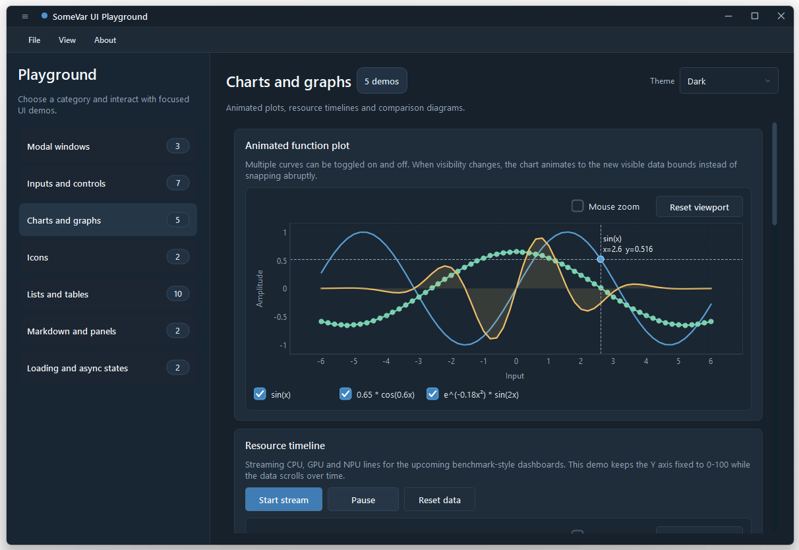
</p>

<p align="center">
  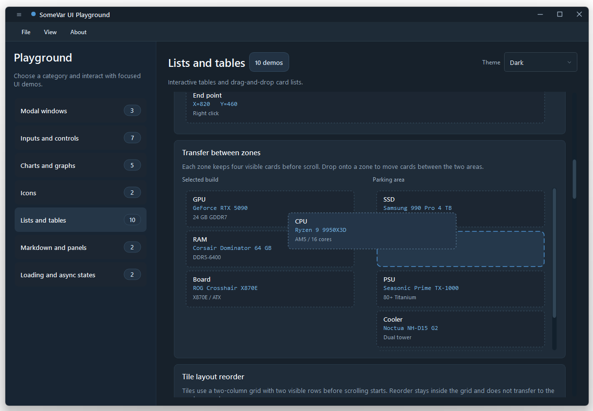
</p>

## Screenshots

| Charts and dashboards | Tables and cards |
| --- | --- |
| 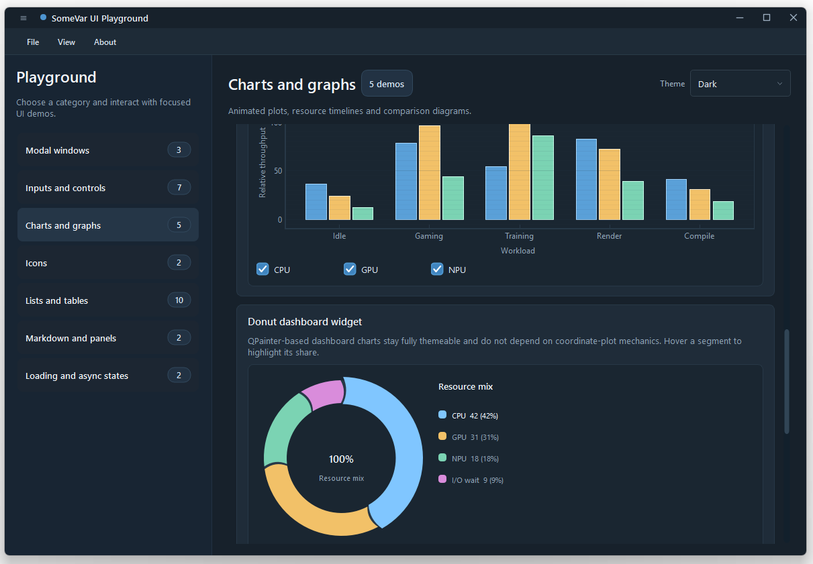 | 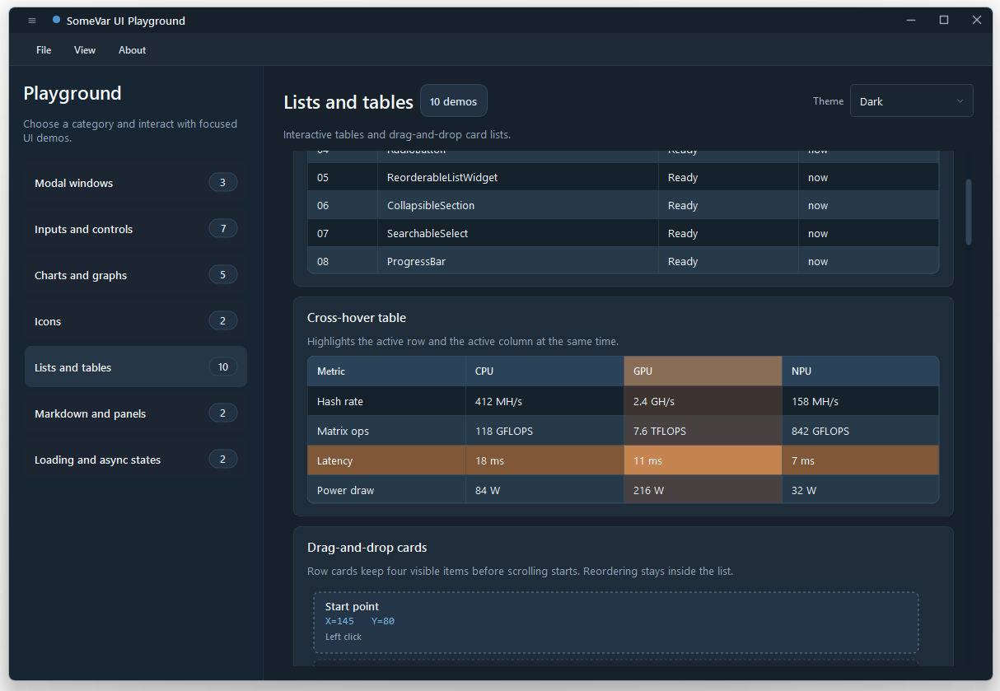 |

| Inputs and icons | Modals and windows |
| --- | --- |
| 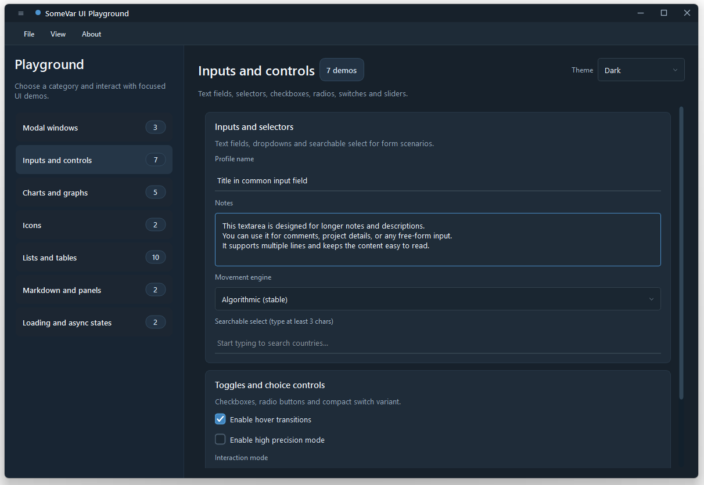 | 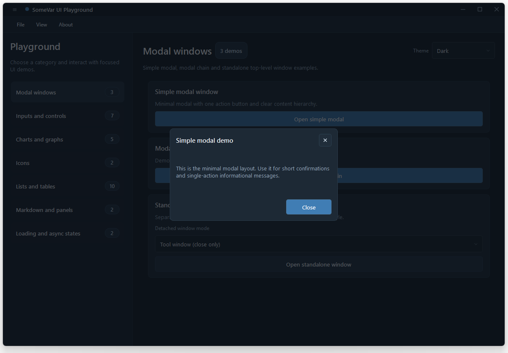 |
| 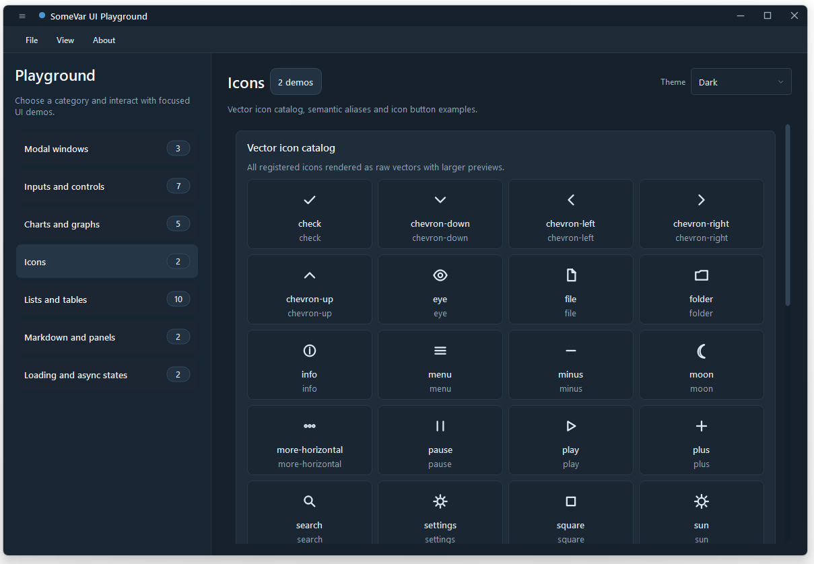 | 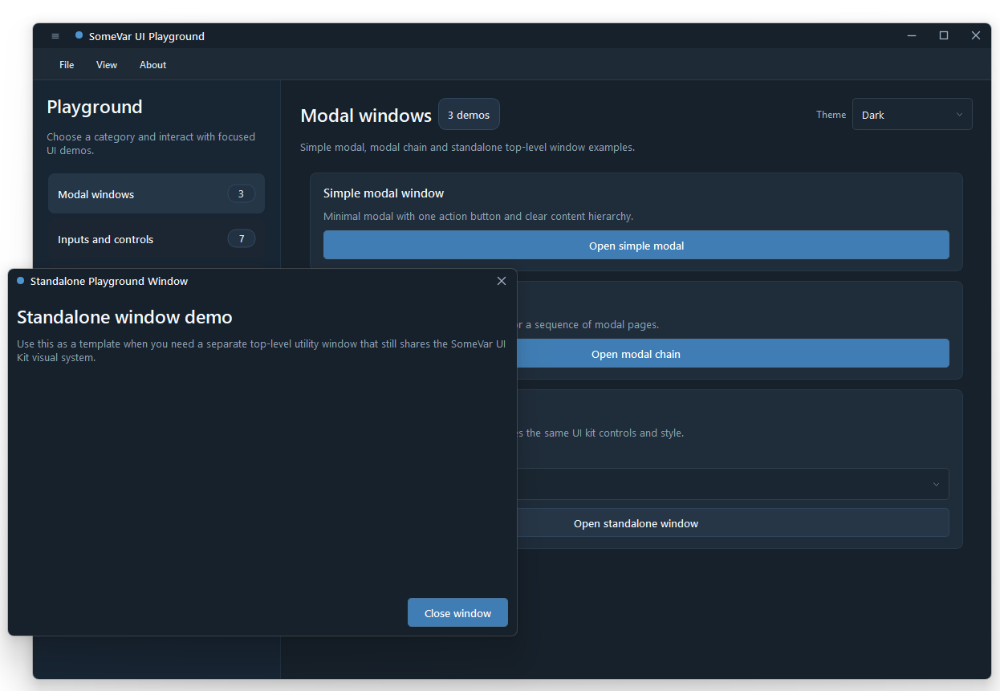 |

| Rich content | Progress states |
| --- | --- |
| 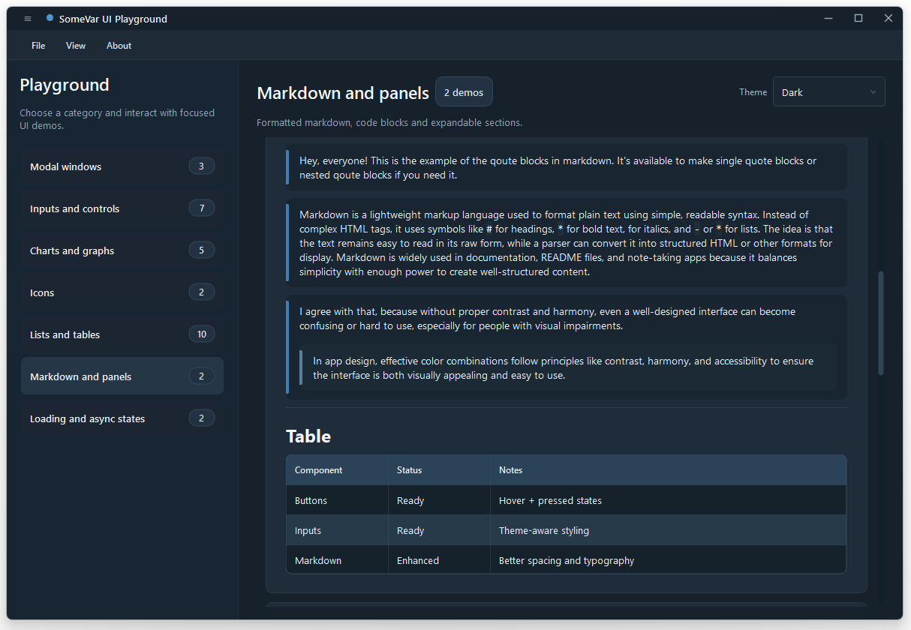 | 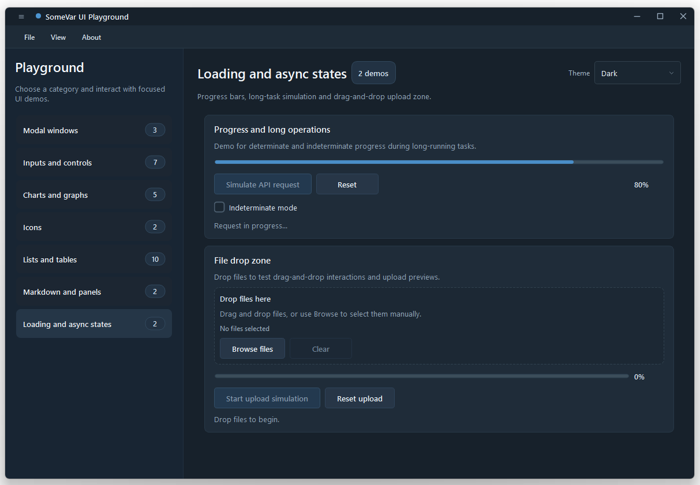 |
| 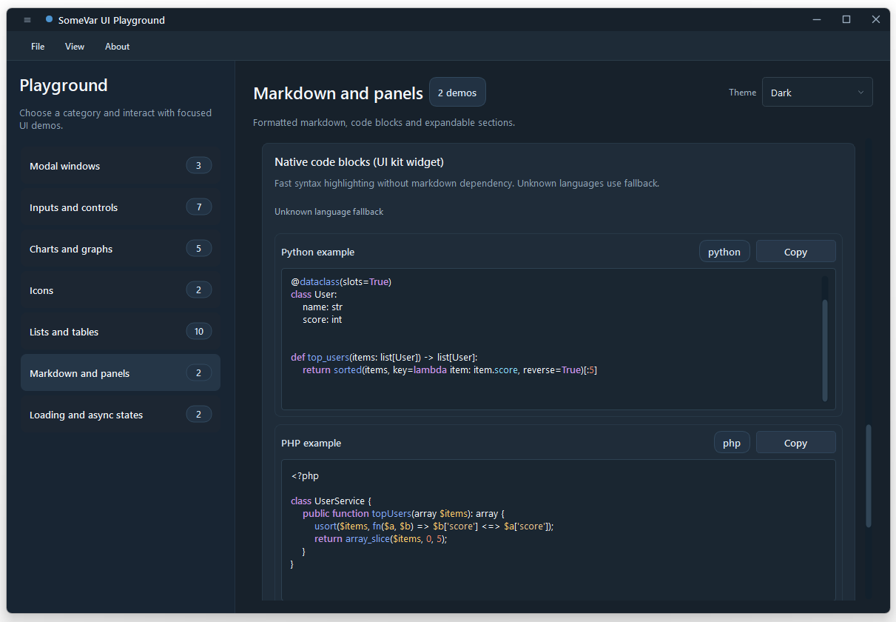 |  |

## Run

```shell
uv sync --extra dev
uv run somevar-ui run
```

The app is configured through `somevar-ui.toml`:

```toml
[app]
id = "playground"
title = "SomeVar UI Playground"
entry = "somevar_ui_playground.main:main"
```

## Development

```shell
uv run python -m pytest
uv run somevar-ui doctor
uv run somevar-ui build --mode onedir
```

Use the playground as a visual regression surface for framework changes. Reusable code belongs in `somevar-ui`; playground-specific pages and demo data belong in this package.

## License

SomeVar UI Playground is released under the [MIT License](LICENSE).

## Author

Created by [JQ / quoterbox](https://github.com/quoterbox).
